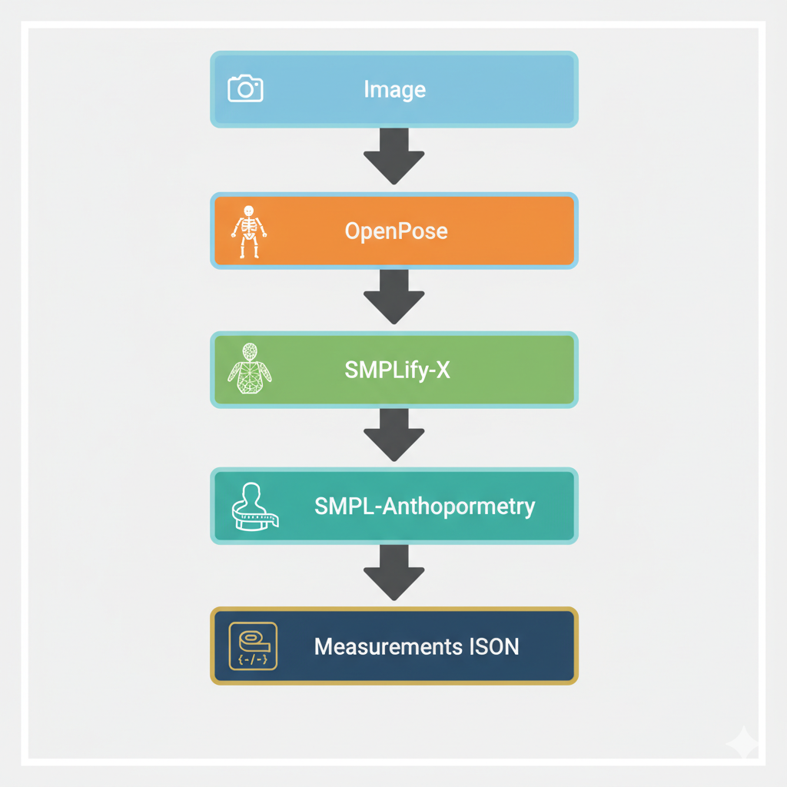
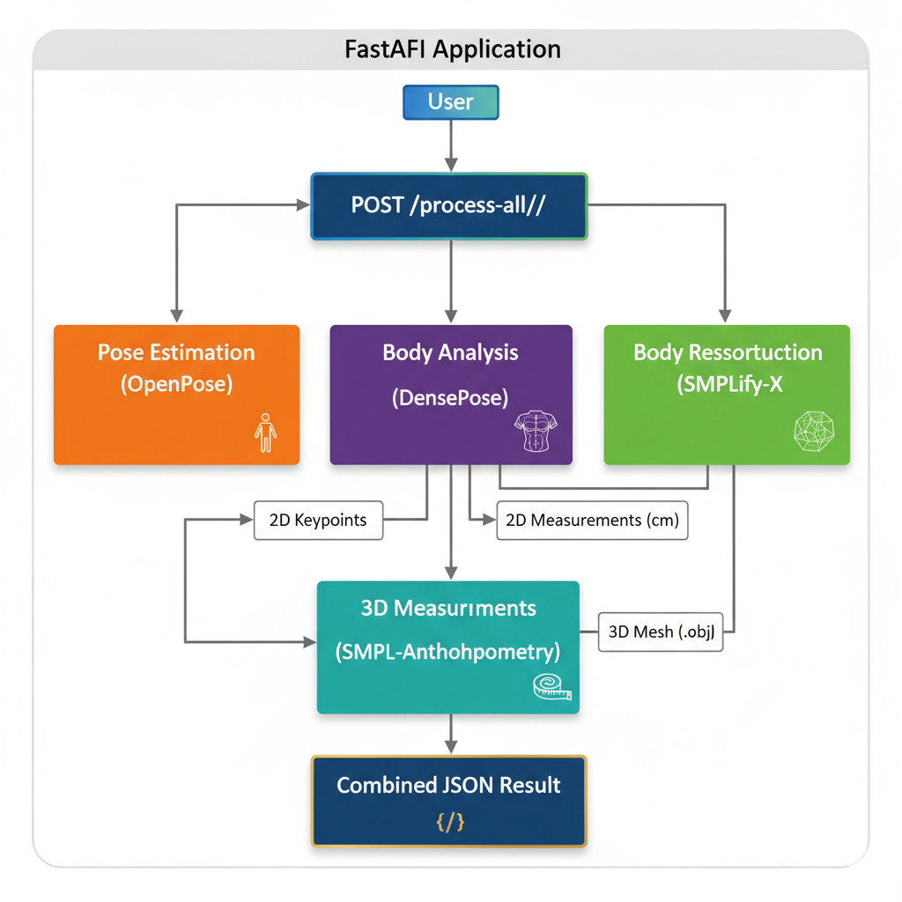
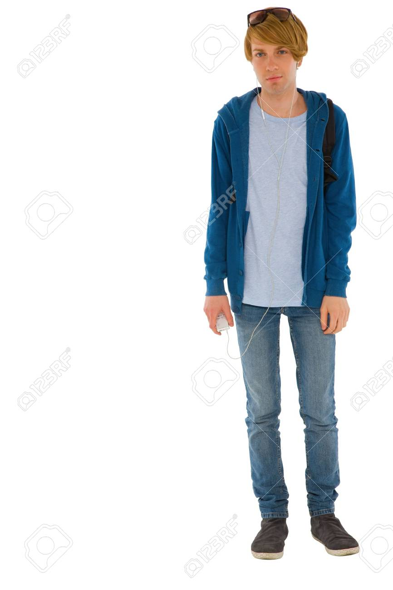
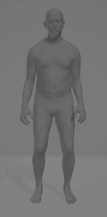
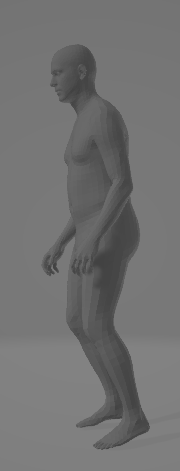
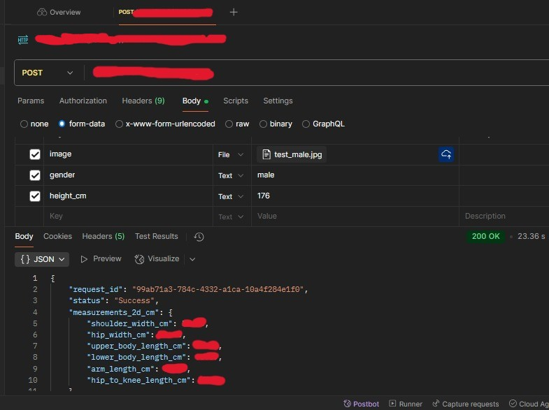

# AI Human Body Measurement Pipeline

A production-oriented AI pipeline for extracting human body measurements from a single RGB image using computer vision, human pose estimation, 3D body reconstruction, and anthropometric analysis.

The system combines OpenPose, DensePose, SMPLify-X, and SMPL Anthropometry to generate both 2D and 3D body measurements that can be used for:

* Virtual Try-On Systems
* Apparel Size Recommendation
* Body Shape Analysis
* Digital Human Modeling
* AR/VR Applications
* E-commerce Sizing Solutions

---
## Pipeline Architecture



---

## Features

### Human Pose Estimation

* Full body keypoint detection using OpenPose
* Face landmark extraction
* Hand landmark extraction
* Single-person optimized inference

### Dense Body Analysis

* DensePose-based body segmentation
* 2D body measurement estimation
* Human silhouette analysis

### 3D Human Reconstruction

* SMPL-X body fitting from monocular images
* Parametric human body reconstruction
* 3D mesh generation (.obj)

### Anthropometric Measurements

Automatic extraction of:

* Height
* Shoulder Breadth
* Chest Circumference
* Waist Circumference
* Hip Circumference
* Neck Circumference
* Head Circumference
* Arm Length
* Wrist Circumference
* Forearm Circumference
* Bicep Circumference
* Thigh Circumference
* Calf Circumference
* Ankle Circumference
* Inseam Length

### API Deployment

* FastAPI backend
* JSON output
* Production-ready architecture
* GPU acceleration support

---


## Technologies

### AI / Computer Vision

* OpenPose
* DensePose
* Detectron2
* SMPL-X
* SMPLify-X
* SMPL Anthropometry

### Backend

* FastAPI
* Python 3.10
* PyTorch

## API Flow



---

### Supporting Libraries

* OpenCV
* NumPy
* TorchVision

---

## Gender-Aware Body Modeling

The pipeline uses dedicated body models for:

* Male
* Female

This improves the quality of body reconstruction and measurement estimation by selecting the appropriate SMPL-X model during inference.

---

## Age Scope

This project is intended for users aged 16 years and older.

The underlying body reconstruction and anthropometric estimation workflow was designed and evaluated for adolescent and adult body proportions.

Using the system for younger children is not recommended.

---
## Results

Input Image Example



Generated Mesh Output

Front




Side





---

## Example Output

```json
{
    "head circumference": 56.52,
    "neck circumference": 39.22,
    "chest circumference": 106.84,
    "waist circumference": 94.87,
    "hip circumference": 104.14,
    "arm right length": 55.16,
    "shoulder breadth": 35.87,
    "height": 177.46
}
```

---

## API Request

```http
POST /process-all/
```

### Parameters

| Parameter    | Type   |
| ------------ | ------ |
| image        | File   |
| height       | Float  |
| gender       | String |
| focal_length | Float  |

---


## API Response

```json
{
  "request_id": "uuid",
  "status": "Success",
  "measurements_3d_cm": {},
  "measurements_2d_cm": {},
  "mesh_file": "mesh.obj"
}
```

---

## API Flow



---


## Installation

### 1. Create Environment

```bash
python3.10 -m venv venv
source venv/bin/activate
```

### 2. Install Dependencies

```bash
pip install -r requirements.txt
```

### 3. Install PyTorch

Example for CUDA 12.6:

```bash
pip install torch torchvision torchaudio --index-url https://download.pytorch.org/whl/cu126
```

Replace the CUDA version according to your system.

---

## Clone Required Repositories

```bash
mkdir models
cd models

git clone https://github.com/facebookresearch/detectron2.git

git clone https://github.com/CMU-Perceptual-Computing-Lab/openpose.git

git clone https://github.com/vchoutas/smplx.git

git clone https://github.com/vchoutas/smplify-x.git

git clone https://github.com/DavidBoja/SMPL-Anthropometry.git

git clone https://github.com/vchoutas/torch-mesh-isect.git

*Read requirements.txt and documentation.docx for more info*
```

---

## Run API

```bash
python3 api.py
```

---

## Project Structure

```text
AI-HUMAN-BODY-MEASUREMENT-PIPELINE
│
├── app
│   ├── api.py
│   ├── pose_estimation.py
│   ├── body_analysis.py
    ├── body_reconstruction.py
│   └── body_measurements.py
│
├── docs
│   ├── 3d-output.obj
│   ├── input-example.jpg
│   ├── api-flow.png
|   ├── architecture.png
    ├── api-request.jpeg
│   └── Documentation.docx
│
├── requirements.txt
│
└── README.md
```

---


## Author

**Mohamed Eltelawy**

Software Engineer focused on Computer Vision,
3D Human Reconstruction,
AI Systems,
and AR/VR Applications.

Focused on:

* Computer Vision
* Human Pose Estimation
* 3D Human Reconstruction
* Generative AI
* AR/VR Systems
* Intelligent Measurement Solutions

---

## Disclaimer

This repository represents a personal implementation and research-oriented version of a human body measurement pipeline.

This is just a demo to prove the concept.

This project should not be used as a substitute for professional medical, health, or anthropometric assessment.

All rights to the High-Accuracy, production-ready version of this technology are owned by EGYROBO.

